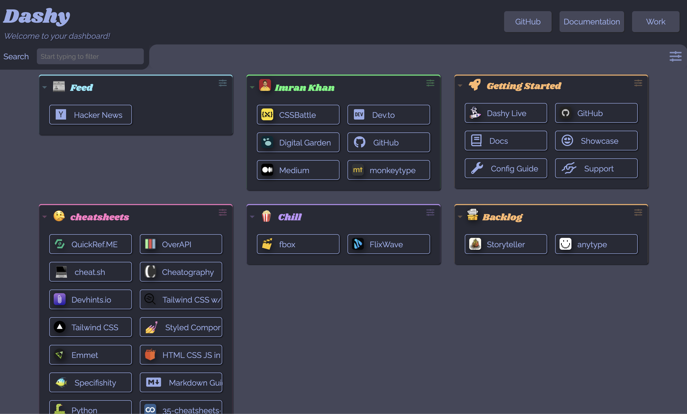

# dotfiles

Collection of my config files.

## Setup

```bash
echo ".dotfiles" >> ~/.gitignore
git clone --bare git@github.com:astr0n0mer/.dotfiles.git ~/.dotfiles
```

## [Dashy](https://idashy.vercel.app/)


